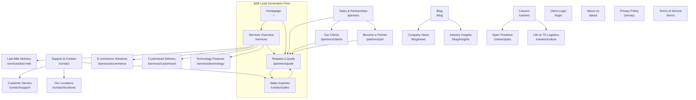

# User Flow — TD Logistics Website

```mermaid
graph TD
  %% Primary Pages (accessible from main navigation)
  Homepage["Homepage<br/>/"]
  Services["Services Overview<br/>/services"]
  Partners["Sales & Partnerships<br/>/partners"]
  Blog["Blog<br/>/blog"]
  Careers["Careers<br/>/careers"]
  Contact["Support & Contact<br/>/contact"]
  ClientLogin["Client Login<br/>/login"]

  %% Services Detail Pages
  Services --> LastMile["Last-Mile Delivery<br/>/services/last-mile"]
  Services --> Ecommerce["E-commerce Solutions<br/>/services/ecommerce"]
  Services --> Customized["Customized Delivery<br/>/services/customized"]
  Services --> Technology["Technology Features<br/>/services/technology"]

  %% Partnership & Sales Pages
  Partners --> RequestQuote["Request a Quote<br/>/partners/quote"]
  Partners --> OurClients["Our Clients<br/>/partners/clients"]
  Partners --> BecomePartner["Become a Partner<br/>/partners/join"]

  %% Blog Section
  Blog --> CompanyNews["Company News<br/>/blog/news"]
  Blog --> IndustryInsights["Industry Insights<br/>/blog/insights"]

  %% Careers Section
  Careers --> OpenPositions["Open Positions<br/>/careers/jobs"]
  Careers --> LifeAtTD["Life at TD Logistics<br/>/careers/culture"]

  %% Contact & Support
  Contact --> CustomerService["Customer Service<br/>/contact/support"]
  Contact --> SalesInquiries["Sales Inquiries<br/>/contact/sales"]
  Contact --> OurLocations["Our Locations<br/>/contact/locations"]

  %% Core Business Features (end-to-end B2B lead generation flow)
  subgraph "B2B Lead Generation Flow"
    Homepage --> Services
    Services --> RequestQuote
    RequestQuote --> SalesInquiries
  end

  %% About & Legal (Footer navigation)
  About["About Us<br/>/about"]
  Privacy["Privacy Policy<br/>/privacy"]
  Terms["Terms of Service<br/>/terms"]

  %% Cross-page Navigation (meaningful shortcuts)
  Homepage --> RequestQuote
  OurClients --> RequestQuote
  BecomePartner --> RequestQuote
  SalesInquiries --> RequestQuote
```